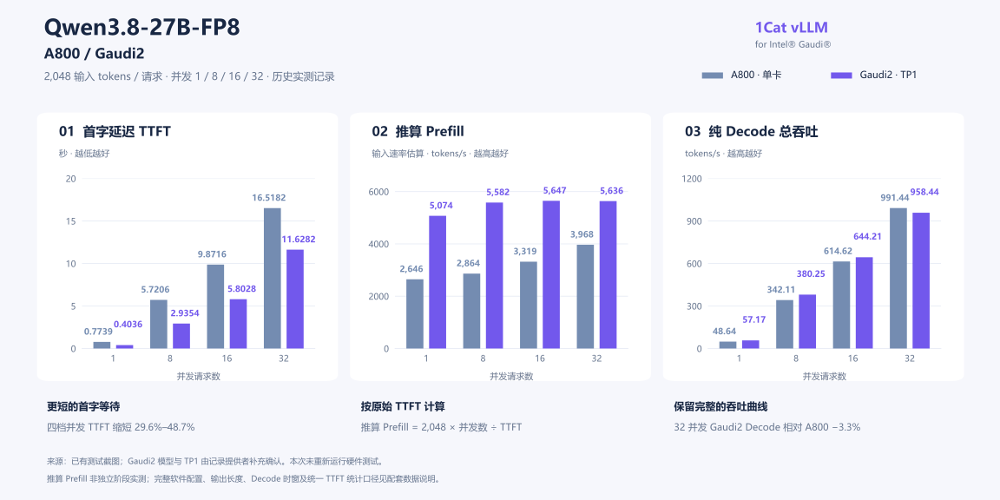

<!-- markdownlint-disable MD041 -->

<p align="center">
  
</p>

# 1Cat-vLLM-Gaudi

<!-- pyml disable-next-line no-trailing-punctuation -->
## Let's Gaudi it.

### 面向 Intel® Gaudi® 的现代大模型推理与原生执行优化

<strong>Qwen · DeepSeek · FlashInfer-Gaudi · TPC / MME · Native Replay</strong>

> 让现代大模型，在 Gaudi 上真正跑快。
>
> 从权重进入内存，到第一个 token 返回，再到每一轮 decode——每一段执行成本，都值得认真优化。

**1Cat-vLLM-Gaudi** 是 1CatAI 维护的 [vLLM-Gaudi](https://github.com/vllm-project/vllm-gaudi) 硬件插件工程分支，需要配套的 vLLM 推理引擎。我们将 **Gaudi2** 作为重点优化目标，把模型适配、权重布局、算子、通信和执行计划放在同一条推理路径里打磨。

在已留存的 **Qwen3.8-27B-FP8 · Gaudi2 · TP1** 单请求记录中，输入 2,048 tokens：

### 0.4036 s 首字 · 57.17 tokens/s Decode

对应 A800 单卡记录为 **0.7739 s / 48.64 tokens/s**；Gaudi2 首字延迟缩短 **47.8%**，Decode 提升 **17.5%**。

这里展示已有实测记录，配置与统计说明随数据保留。[查看完整对照](#performance) · [数据来源与口径](docs/benchmarks/qwen38-a800-gaudi2.md)

[性能记录](#performance) · [工程路线](#engineering) · [模型支持](#models) · [构建与启动](#quick-start) · [工程指南](docs/1cat_gaudi_guide.md) · [参与贡献](#contributing)

---

<a id="performance"></a>

## 📊 Performance First

### Qwen3.8-27B-FP8 · A800 / Gaudi2

**从单请求响应，到 32 并发吞吐。**

每个请求输入 **2,048 tokens**，并发请求数为 **1 / 8 / 16 / 32**。Gaudi2 的 **TP1 与模型名称**已由记录提供者确认；A800 单卡与模型信息来自原始截图。



| 并发请求数 | TTFT：A800 → Gaudi2（秒） | 首字延迟缩短 | Decode 总吞吐：A800 → Gaudi2（tokens/s） | Decode 变化 |
|---:|---:|---:|---:|---:|
| **1** | 0.7739 → **0.4036** | **47.8%** | 48.64 → **57.17** | **+17.5%** |
| **8** | 5.7206 → **2.9354** | **48.7%** | 342.11 → **380.25** | **+11.1%** |
| **16** | 9.8716 → **5.8028** | **41.2%** | 614.62 → **644.21** | **+4.8%** |
| **32** | 16.5182 → **11.6282** | **29.6%** | 991.44 → **958.44** | **−3.3%** |

这组记录里，Gaudi2 在四档并发下都有更短的首字延迟。单请求 Decode 为 **57.17 tokens/s**，32 并发 Decode 总吞吐达到 **958.44 tokens/s**。

吞吐曲线也保留了值得继续优化的一段：在 32 并发时，Gaudi2 的 Decode 总吞吐比 A800 低 **3.3%**。让响应更快、让并发扩展更好，是两项需要分别检验的工作。

> **测量口径：**
>
> 图中“推算 Prefill”按 `2,048 × 并发数 ÷ TTFT` 计算，是输入速率估算；TTFT 包含其他开销，也未必等于整批请求的 prefill 完成时间。Decode 沿用原记录的纯 Decode 总吞吐。完整软件配置、输出长度、Decode 计时窗口与一致的 TTFT 统计口径尚待补齐；本表描述已有记录，不将差异归因于某一项优化。

[完整数值与计算公式](docs/benchmarks/qwen38-a800-gaudi2.md) · [原始截图](assets/benchmarks/a800-gaudi2-source.png) · [结构化数据](docs/benchmarks/qwen38-a800-gaudi2.json)

### DeepSeek V4.1 · 稳态 Decode 延迟降低约 1/3

<strong>4× Gaudi2 · TP2 × PP2 · 普通 C1</strong>

[PR #26](https://github.com/1CatAI/1Cat-vLLM-Gaudi/pull/26) 将 FP8 sidecar、Attention 投影与归一化、Q scaling + RoPE、mHC gates 和 expert finalize 等工作整合进专用入口。在三次完整模型运行中，相对该 PR 的 trace-driven 起点，稳态 decode 延迟降低约 **三分之一**。

DSpark 则沿着独立的验证与状态提交路径继续推进：

| 路线 | 测量范围 | 相对对应候选基线的变化 | 来源 |
|---|---|---:|---|
| **普通 C1** | 三次完整模型运行的稳态 decode | 延迟降低约 **1/3** | [#26](https://github.com/1CatAI/1Cat-vLLM-Gaudi/pull/26) |
| **DSpark C6** | 完整 C6 transaction | 延迟降低 **29.7%** | [#25](https://github.com/1CatAI/1Cat-vLLM-Gaudi/pull/25) |
| 同一 DSpark 工作负载 | post-TTFT decode | 延迟降低 **28.5%** | [#25](https://github.com/1CatAI/1Cat-vLLM-Gaudi/pull/25) |
| 同一 DSpark 工作负载 | 包含 prompt / prefill 的完整请求 | 延迟增加约 **0.8%** | [#25](https://github.com/1CatAI/1Cat-vLLM-Gaudi/pull/25) |

完整请求保留了 N256 prefill 兼容路径的成本。这个结果直接决定下一步优化方向：继续收紧 prefill、decode 与状态交接之间的开销。

**C1 表示普通单 token decode，C6 表示六 token 验证工作负载；它们与上表的并发请求数含义不同。** 两条路线的相对收益各有基线，不能相加。上述 DeepSeek 专用配置处于单请求、512-token 总上下文的实验验证范围。

[DeepSeek 测量与验证记录](docs/benchmarks/deepseek-records.md)

---

<a id="engineering"></a>

## 🔥 Built for Gaudi

Gaudi 上的推理优化，需要同时看见 **内存里的权重、设备上的状态，以及每一轮实际提交的工作**。

```text
Checkpoint / Prepared weights
              ↓
       模型分片与输入准备
              ↓
    Attention / MoE / GDN / mHC
              ↓
   KV / Recurrent state / Engram
              ↓
   TPC + MME + 通信 + Native replay
              ↓
        采样、状态提交与输出
```

### 权重按执行方式准备

DeepSeek 的 prepared 路径先校验模型 revision 与文件身份，再按目标 TP / PP 拓扑生成分片，整理 **Q16 / S16 专家布局、scale 编码与 K 对齐**。

每个 rank 保留一份压缩专家权重的常驻分配，让后续算子直接消费需要的布局，减少长期重复的展开副本。V4.1 普通 C1 组合进一步使用 N256 FP8 expert 与融合准备路径。

**把可以提前做的准备，移出每一轮 decode。**

存储精度与计算精度分别记录：例如 block-FP8 linear 可以经 TPC 解量化后进入 **BF16 MME**；`--dtype bfloat16` 也不能概括所有权重、缓存、scale 与累加精度。

### Attention，沿着数据依赖一起优化

Q / KV 投影、归一化、RoPE、稀疏选择、KV 写入和输出投影，串起了完整的 Attention 执行链。

本分支围绕这条链组织融合与布局：让 **Q scaling + RoPE** 连续执行，让 selected-row 路径只处理有效行，让 shared-KV MME 与指定投影的 FP8 sidecar 配合，并保留 KV producer 到 consumer 的依赖。

TPC 处理适合专用实现与融合的张量计算，MME 承担相应矩阵计算。二者交接时少一次冗余转换、少一个临时结果，都有机会降低完整算子链的成本；是否采用候选实现，仍由精度和整模型测量决定。

### Engram：主机映射，按需送入设备

V4.1 的 Engram 路径把主机表按完整 hash heads 分片，通过源文件映射与 native gather，取出当前步骤需要的数据：

```text
只读 checkpoint → mmap / 页缓存 → native gather
               → HPU-pinned staging → DMA → 模型消费
```

generation 与完成事件保护 staging buffer，确保上一轮消费完成后再复用。模型因此可以按需访问主机表，同时把传输和状态生命周期纳入执行计划。

**原始 Engram 源文件仍是运行依赖。** prepared 权重生成后需继续保留这些文件；主机 RAM、页缓存、磁盘与 NUMA 条件也属于部署配置。

[深入了解权重、Attention 与 Engram](docs/features/1cat_gaudi_execution.md)

---

## ⚡ Native Replay

### 让每一轮 Decode，复用准备好的执行计划

固定形状 decode 会重复经过相同的模型层。native replay 预先准备权重、输入与状态地址，捕获计算和通信计划；每一轮更新真实输入、执行计划并提交状态。

```text
准备固定地址 → 编译 / 捕获 → 恢复 capture 状态
                                 ↓
             更新输入 → Replay → 消费输出与安全复用
                ↑__________________________|
```

V4 native decoder 的限定路线覆盖 **43 层、86 次 decoder reductions**，包括末尾的 **mHC、HC head 和 norm**。embedding reduction、最终输出投影和采样由外围路径执行。

V4.1 则以 **TP2 × PP2** 组织 stage replay、PP 状态交接、mHC / TP 依赖及独立的 DSpark 验证。

这条路线的关键，是让计算、通信和状态拥有明确的完成顺序。缓存重分配、权重重载、通信器变化或状态地址重绑时，旧执行计划必须失效。

[执行架构](docs/features/1cat_gaudi_execution.md#native-replay) · [V4.1 prepared execution](docs/features/deepseek_v41.md)

---

## 🧠 GDN：从状态布局到编译图

Gated Delta Rule 的成本来自矩阵计算，也来自 recurrent state 的读取、更新和搬运。

Qwen GDN 路线围绕 **紧凑 Q / K heads、KKT 与 causal-decay 复用、静态三角 mask、分块求解、fused direct-state decode** 组织计算。MME 执行矩阵工作，外围张量操作由编译图融合。

当前重点 prefill 形状：

| 配置 | Q / K heads | V heads | K / V dimension |
|---|---:|---:|---:|
| **TP1** | 16 | 48 | 128 / 128 |
| **TP2，每 rank** | 8 | 24 | 128 / 128 |

该 prefill tactic 面向 **单条均匀序列、BF16 输入、chunk 128**；默认 recurrent state 保持 **FP32**。重点 fused decode buckets 为 **1 / 2 / 4 / 8 / 16 / 32**，具体状态布局与路径需要分别匹配。

在已配对的 Qwen 引擎与插件环境中启用：

```bash
export VLLM_HPU_FLASHINFER_GDN=1
export FLASHINFER_GAUDI_BACKEND=auto
```

TP2 另需 `VLLM_HPU_FLASHINFER_GDN_TP2=1`。归一化、状态精度与回滚语义均保留独立验证。

[形状与精度契约](docs/features/1cat_gaudi_execution.md#gdn-与-dflash2) · [Qwen 启动指南](docs/1cat_gaudi_guide.md#qwen-dflash2)

---

## 🚀 DFlash2：一次提出候选，整块验证

Qwen DFlash2 一次提出 **7 个 draft tokens**，经过 HPU top-16 selector 选出路径，由 target 验证 **8-token block**。

```text
Draft → HPU selector → Target block verification
                                   ↓
                    接受前缀 → 恢复对应状态 → 下一轮
```

每一步卷积与 GDN checkpoint 都参与接受和回滚，让 speculative decoding 的状态更新与 target 执行保持一致。

当前实验范围为 **贪心文本、TP1 / PP1 / DP1、最多 16 个序列、compact GDN state、关闭 prefix caching 与 LoRA**。DFlash2 默认关闭；DeepSeek V4.1 的 DSpark 采用另一套模型与执行集成。

首页 Qwen 历史数据没有附带 DFlash2 开关记录，因此不作为 DFlash2 的性能成绩。

[配置与完整启动命令](docs/1cat_gaudi_guide.md#qwen-dflash2)

---

## 🧩 FlashInfer-Gaudi

**熟悉的推理原语，面向 Gaudi 的执行选择。**

`flashinfer_gaudi` 使用独立命名空间，部分 API 语义对齐 **FlashInfer 0.6.18**，并提供 Gaudi 扩展：GDN prefill / decode、fused decode、MTP / rollback、activation / quant、residual / norm / quant，以及 block-FP8 linear。

```python
import json
from flashinfer_gaudi import get_capabilities

print(json.dumps(get_capabilities(), indent=2, ensure_ascii=False, default=str))
```

`auto` 保留已建立的服务编译图策略；`pytorch` 提供参考路线。`native`、`public`、`bridge` 要求操作满足对应原生契约，不满足时明确拒绝。部分 GDN TPC 原型仍带数值 prologue，需按能力报告判断可用范围。

[API 与后端策略](docs/features/1cat_gaudi_execution.md#flashinfer-gaudi) · [上游兼容说明](https://github.com/1CatAI/1Cat-vLLM-Gaudi/blob/ac14567637ca1d8f3d4434e62dbab3317ebe9fbe/docs/features/flashinfer_gaudi.md)

---

<a id="models"></a>

## 🎯 模型与执行范围

| 路线 | 当前配置范围 | 启用方式与状态 |
|---|---|---|
| **Qwen GDN** | Qwen3.8-27B 重点形状；TP1 / TP2 | 显式启用 GDN；TP2 另有开关 |
| **Qwen DFlash2** | TP1 / PP1 / DP1；贪心文本；最多 16 个序列 | 默认关闭，实验路径 |
| **DeepSeek V4 Flash** | Gaudi2 × 2；TP2 / PP1；单请求；512 tokens 总上下文 | 专用入口使用普通 decode 与区域编译 |
| **DeepSeek V4 native decoder** | TP2 / PP1；单 token decode；512 tokens 总上下文 | 默认关闭，需独立 native runtime |
| **DeepSeek V4.1 Flash C1** | Gaudi2 × 4；TP2 × PP2；单请求；贪心；512 tokens 总上下文 | **专用入口默认启用实验 C1 组合**；需配套引擎与 runtime |
| **DeepSeek V4.1 DSpark** | 独立 prepared / draft / replay 配置 | 默认关闭 |
| 通用 HPU 模型 | 由引擎、插件、模型及软件版本共同决定 | 参考[继承的功能范围](https://github.com/1CatAI/1Cat-vLLM-Gaudi/blob/ac14567637ca1d8f3d4434e62dbab3317ebe9fbe/docs/features/supported_features.md) |

DeepSeek 的上述专用配置仍处于实验验证阶段，512 tokens 为输入与输出共享的总上下文预算。V4.1 从零部署所需的引擎锁定信息尚未完整归档，现阶段请从已验证的配套环境开始；准备条件见[工程指南](docs/1cat_gaudi_guide.md#deepseek-v41)。

---

<a id="quick-start"></a>
<a id="getting-started"></a>
<a id="installation"></a>

## 📦 Build & Run

### 准备配套环境

DeepSeek 源码集成的基线为 **Gaudi Software 1.24.1 + 匹配的 Gaudi PyTorch 2.11**。专用工具使用 Python 3.11+ 接口，建议选择配套的 Python 3.11 / 3.12 环境。

```bash
git clone https://github.com/1CatAI/1Cat-vLLM-Gaudi.git
cd 1Cat-vLLM-Gaudi
```

`vllm_gaudi` 是 Python 包名。按[安装指南](docs/1cat_gaudi_guide.md#installation)固定插件、引擎和 Bridge 版本，并完成对应构建；以下命令使用 Linux / Bash，从仓库根目录执行。

### 选择模型路线

<a id="serving"></a>
<a id="v4-serving"></a>

#### DeepSeek V4 Flash · 2×Gaudi2

完成[固定引擎与原生库构建](docs/1cat_gaudi_guide.md#deepseek-v4)后：

```bash
HABANA_VISIBLE_MODULES=0,1 \
python -m vllm_gaudi.entrypoints.deepseek_v4 \
  /path/to/DeepSeek-V4-Flash \
  --served-model-name deepseek-v4-flash \
  --host 127.0.0.1 \
  --port 8000
```

入口选择 TP2、单请求和 512-token 总上下文。整段 native decoder replay 需要另外启用。

<a id="v41-serving"></a>

#### DeepSeek V4.1 Flash · 4×Gaudi2

先完成[引擎、runtime、prepared 权重与 sidecar 准备](docs/1cat_gaudi_guide.md#deepseek-v41)。使用显式模块选择和共享设备锁启动：

```bash
python tools/run_deepseek_v41.py \
  --lock-dir /path/to/shared-device-locks \
  --runtime-profile /path/to/verified-runtime-profile.json \
  --modules 0,1,2,3 \
  /path/to/new-run-evidence \
  -- \
  python -m vllm_gaudi.entrypoints.deepseek_v41 \
    /path/to/DeepSeek-V4.1-Flash-prepared \
    --checkpoint-audit /path/to/checkpoint-audit \
    --host 127.0.0.1 \
    --port 8000
```

路径与设备编号需要对应本机。启动器选项放在 evidence 位置参数之前。专用入口默认使用普通 C1 组合，DSpark 默认关闭；设备租赁入口会保留所选模块。配置优先级和 profile 结构见[运行配置](docs/1cat_gaudi_guide.md#runtime-profile)。

<a id="dflash2-serving"></a>

#### Qwen GDN / DFlash2

在已配对的 Qwen 引擎与插件环境中，可启用 GDN：

```bash
export VLLM_HPU_FLASHINFER_GDN=1
export FLASHINFER_GAUDI_BACKEND=auto
```

TP2 另需 `VLLM_HPU_FLASHINFER_GDN_TP2=1`。DFlash2 的独立启动命令、状态与缓存条件见[Qwen 指南](docs/1cat_gaudi_guide.md#qwen-dflash2)。

### 发起请求

以下请求对应 V4.1 的默认服务名：

```bash
curl --fail --show-error http://127.0.0.1:8000/health

curl --fail --show-error --no-buffer \
  http://127.0.0.1:8000/v1/chat/completions \
  -H 'Content-Type: application/json' \
  -d '{
    "model": "DeepSeek-V4.1-Flash",
    "messages": [{"role": "user", "content": "请用一句话解释张量并行。"}],
    "temperature": 0,
    "max_tokens": 64,
    "stream": true
  }'
```

V4.1 目前要求不附加采样修饰的贪心请求；`logprobs`、结构化输出及若干 token 约束暂不支持。完整参数范围见[API 条件](docs/1cat_gaudi_guide.md#api-contract)。示例监听 localhost，对外服务需配置认证与访问控制。

---

## ✅ Correctness & Quality

**速度、输出质量和执行稳定性，一起推进。**

算子数值、模型输出、完整请求和长时间运行各有验证范围。代码合并与单元测试通过，保留为对应范围内的证据。

| 工程进展 | 已记录的检查 | 仍在推进的验证 |
|---|---|---|
| **V4.1 普通 C1 组合 · [#26](https://github.com/1CatAI/1Cat-vLLM-Gaudi/pull/26)** | 61 项单元测试通过、14 项硬件依赖测试在 CPU 运行中跳过；另有针对性 HPU 检查 | 完整模型质量、prefill 一致性、长 replay / shutdown |
| **V4.1 DSpark replay · [#25](https://github.com/1CatAI/1Cat-vLLM-Gaudi/pull/25)** | 494 项相关单元测试通过、58 跳过；记录覆盖 28 项针对性 Gaudi 硬件检查 | 状态语义与完整请求性能 |
| **V4 prepared native decode · [#21](https://github.com/1CatAI/1Cat-vLLM-Gaudi/pull/21)** | 96 项 CPU / meta 测试通过、16 项硬件门控测试跳过；native topology 回归通过 | 生产参考 token / logprob 一致性、独立异步链退出 |

V4 普通路径仍有冷启动与后续贪心请求的输出差异；V4 native 保留 frozen-reference 差异及独立异步链退出问题；V4.1 C1 相对前一候选存在输出变化。详细状态与检查入口见[验证指南](docs/1cat_gaudi_guide.md#validation)。

这些是对应 PR 留存的测试记录，跳过项不计为通过。

---

## 🧱 Runtime Matters

一条可复现的原生执行路径，需要 **插件、引擎、Bridge、Synapse、HCL、原生扩展和模型制品** 成套匹配。

本项目用 manifest、二进制与配置指纹记录这些关系。部分 replay runtime 基于旧公开源码快照及兼容性补丁，ABI 检查通过只证明所检查的接口与制品关系；数值和编译器等价性仍需单独验证。

这也是工程指南同时保存构建步骤、profile、设备选择、prepared 身份与运行证据的原因：让一次优化能够被定位、被复现，也能在后续升级中继续验证。

[环境与构建指南](docs/1cat_gaudi_guide.md) · [Native runtime 源码与补丁](tools/communication/patches/native-runtime/README.md)

---

<a id="source-map"></a>

## 🗂️ 文档导航

| 文档 | 从这里开始 |
|---|---|
| [工程指南](docs/1cat_gaudi_guide.md) | 环境、构建、prepared 权重、运行配置、API 与排障 |
| [执行架构](docs/features/1cat_gaudi_execution.md) | 权重、Attention、TPC / MME、Engram、replay、GDN 与 DFlash2 |
| [V4.1 专用路线](docs/features/deepseek_v41.md) | prepared 分片、默认 C1 组合与实验状态 |
| [Qwen 数据记录](docs/benchmarks/qwen38-a800-gaudi2.md) | 实测数值、推算公式、来源与条件 |
| [DeepSeek 优化记录](docs/benchmarks/deepseek-records.md) | PR 测量范围、测试结果与当前状态 |
| [环境变量](https://github.com/1CatAI/1Cat-vLLM-Gaudi/blob/ac14567637ca1d8f3d4434e62dbab3317ebe9fbe/docs/configuration/env_variables.md) | 原始默认值、依赖与 profile 范围 |

## 🧭 项目方向

我们希望 Gaudi 用户可以持续获得现代模型支持，并且看得见每一轮优化带来的实际变化：

- **更快的响应**：缩短首字与稳态 decode 延迟。
- **更好的扩展**：减少状态搬运、通信与调度成本。
- **更清楚的质量证据**：让性能成绩对应明确的模型输出和验证范围。
- **更容易复现的环境**：将运行时、权重与配置一起归档。

从单个算子，到整段执行，再到完整请求——让优化持续落到用户真正等待的时间上。

<a id="contributing"></a>

## 🤝 参与贡献与交流

欢迎模型适配、算子、编译、通信、数值验证和文档贡献。性能变更请附上基线、配置、完整请求结果以及尚未完成的验证。

提交请使用 feature branch 和 Pull Request，保留 `Signed-off-by`，遵循 [AGENTS.md](https://github.com/1CatAI/1Cat-vLLM-Gaudi/blob/ac14567637ca1d8f3d4434e62dbab3317ebe9fbe/AGENTS.md)。

[提交 Issue](https://github.com/1CatAI/1Cat-vLLM-Gaudi/issues) · [查看 Pull Requests](https://github.com/1CatAI/1Cat-vLLM-Gaudi/pulls) · [1CatAI 主项目与社区](https://github.com/1CatAI/1Cat-vLLM)

## ❤️ 致谢

感谢 [vLLM](https://github.com/vllm-project/vllm)、[vLLM-Gaudi](https://github.com/vllm-project/vllm-gaudi)、[FlashInfer](https://github.com/flashinfer-ai/flashinfer) 与 Intel Gaudi 软件生态，也感谢包括 [@yangzhuxinyzx](https://github.com/yangzhuxinyzx) 在内的实现、测试与复现贡献者。

## License

代码采用 [Apache License 2.0](https://github.com/1CatAI/1Cat-vLLM-Gaudi/blob/ac14567637ca1d8f3d4434e62dbab3317ebe9fbe/LICENSE)。模型权重与第三方依赖适用各自许可。

<sub>执行源码基准：ac14567637ca1d8f3d4434e62dbab3317ebe9fbe（2026-09-14）。Qwen 数据整理与条件补充：2026-09-15；测量日期未提供。</sub>

<p align="center"><strong>1CatAI · Let's Gaudi it.</strong></p>
